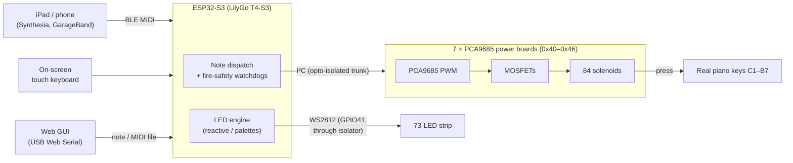
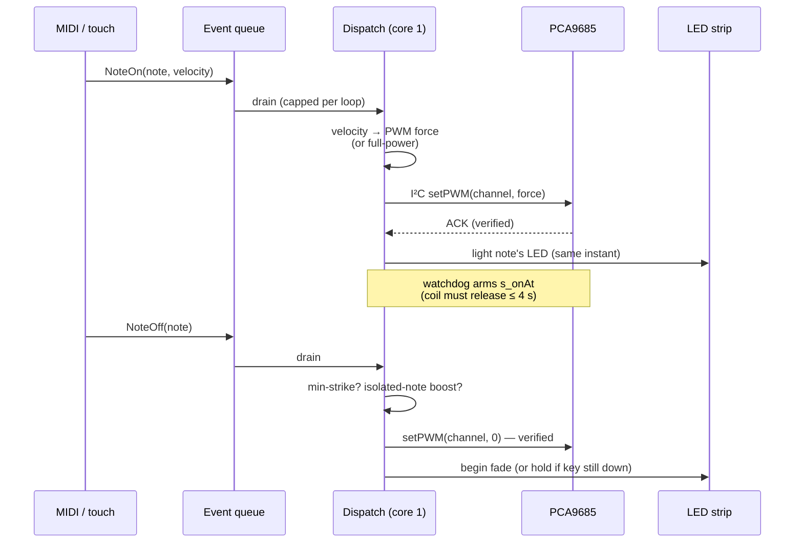
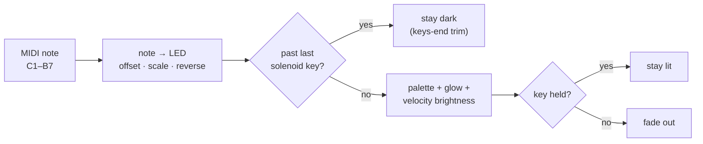
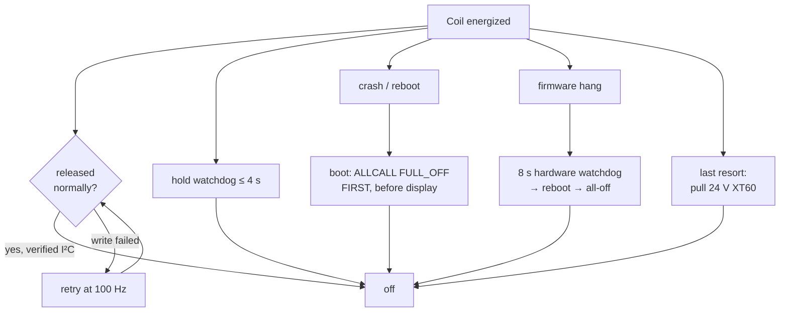

# Player Piano — Project Overview

A visual guide to how the self-playing piano works, end to end. For build/flash
steps see the [README](../README.md); for the fire-safety design see
[SAFETY.md](SAFETY.md).

> **Made by Steven Jin.** Firmware, LED engine, control software, and
> integration. See [PROVENANCE.md](../PROVENANCE.md) for cryptographic
> authorship verification.

---

## What it is

A real acoustic upright piano that plays itself. 84 solenoids press the actual
keys, driven by an ESP32-S3 with a touchscreen. You can feed it music three
ways — stream **Bluetooth MIDI** from an iPad (Synthesia, GarageBand), tap the
**on-screen keyboard**, or drop a **MIDI file** into the web control panel. A
73-LED strip lights up in sync with the keys.

---

## System architecture

- **Master board** hosts the T4-S3. It runs two *separate* I²C buses: the
  module-internal one (touch + power management) and a **dedicated,
  opto-isolated** bus for the power boards — so solenoid switching noise
  physically cannot reach the display.
- Each **power board** is one PCA9685 chip driving 12 MOSFET + solenoid
  channels — one chromatic octave. Address set by a DIP switch.

---

## What happens when a note plays

The LED is lit **at the exact instant the solenoid fires** — not from the
display loop — so lights and sound never drift apart.

---

## Making solenoids musical

Solenoids are basically on/off; these features turn them into an instrument:

| Feature | What it solves |
|---|---|
| Velocity → PWM force | Soft *pp*, swelling *ff* dynamics |
| **Isolated-note strike boost** | A lone staccato note is held longer so it actually sounds; notes inside a run stay short and fast |
| Retrigger gap | Rapid same-key repeats get micro-spaced so the plunger resets |
| Min-strike duration | Ultra-short notes are stretched enough to strike |
| Soft release | Cushion current on release so keys don't clank |
| Auto re-strike | Optional tremolo so held notes keep singing |
| **Feel presets** | 🎬 *Cinematic* (soft/expressive) and ⚡ *Snappy* (fast/dense) set everything at once |

---

## Lighting engine

The 73-LED strip maps the played key range onto physical LEDs, live-calibratable
so each lit LED sits under its key.

- **8 palettes:** rainbow, solid, velocity, fire, ocean, forest, lava, party.
- **Calibration:** two-point — light the lowest key's LED and trim *Offset*,
  then the highest and trim *Scale*. Everything between lines up.
- **Keys-end trim:** LEDs past the last solenoid key stay dark, so *lit = plays*.
- **Sustain:** held keys keep their LED lit; it fades on release.

---

## Reliability & fire-safety (summary)

A stuck-on solenoid is a real fire risk, so protection is layered — see
[SAFETY.md](SAFETY.md) for the full design.

Every release is **verified** (a coil is only "off" after a confirmed I²C ACK),
no coil can stay energized past ~4 s through any path, and a crash releases
everything within ~150 ms of reboot — before the display even initializes.

---

*Player Piano — © 2026 Steven Jin. Licensed under the MIT License.*
